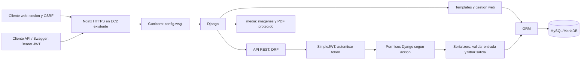

# Documento tecnico: Papi Pollo

**Richard Lopez Nuñez**  
Programacion Back End - INACAP  
Evaluacion Sumativa N.º 3 - Aplicacion API RESTful  
Continuidad de la Evaluacion Sumativa N.º 2.

## Introduccion y descripcion general

Papi Pollo es una aplicacion de gestion de un negocio de comida al paso.
La Evaluacion 2 implemento catalogo, sucursales y pedidos desde una interfaz
web. La Evaluacion 3 incorpora un contrato REST para consultar y administrar
esas mismas entidades desde otros clientes, sin sustituir la web existente.

## Objetivo y alcance

Exponer el catalogo de productos, sucursales y registro de pedidos de Papi Pollo
a clientes externos, conservando su aplicacion web. Se reutilizan los modelos,
tablas y grupos Django, sin reemplazar datos ni crear una segunda transaccion.
La API esta implementada localmente; la actualizacion AWS y sus evidencias no
se presentan como realizadas.

## Arquitectura

El diagrama representa el destino de despliegue, no prueba una instalacion
remota realizada. Localmente runserver sustituye Nginx/Gunicorn. SQLite sigue
disponible y se utiliza en las pruebas aisladas. JWT identifica al solicitante;
los permisos autorizan la accion antes de ejecutar el acceso a los recursos.
Los componentes del diagrama son pasos logicos, no servicios independientes.
La base seleccionada actualmente es MySQL; no se ha migrado ni reemplazado.

## Entidades

- menu.Producto: catalogo, precio de venta, disponibilidad, ImageField imagen,
  FileField ficha_tecnica y fechas. Tabla menu_producto.
- sucursales.Sucursal: nombre, direccion, comuna, telefono comercial, horario,
  activa y fechas. Tabla sucursales_sucursal.
- menu.Pedido: cliente, producto FK, sucursal FK, cantidad, precio_unitario
  historico, estado, observaciones y fechas. Tabla menu_pedido. Total calculado.
- Pedido -> Producto y Pedido -> Sucursal usan PROTECT. No hay Pedido nuevo en
  la app pedidos. La API no define modelos ni necesita nuevas migraciones.

## Implementacion

### Configuracion DRF

settings.py registra rest_framework y api. REST_FRAMEWORK utiliza
JWTAuthentication, JSONRenderer, PageNumberPagination de 20 registros,
IsAuthenticated por defecto y un manejador de excepciones propio. Cada
ViewSet exige permisos Django del modelo, incluso para GET. config/urls.py
monta api.urls bajo /api/v1/ sin reemplazar rutas web. requirements.txt fija
las dependencias instaladas; la API no requiere nuevas tablas.

### Serializers y endpoints

api/serializers.py separa representacion y entrada para evitar asignacion
indebida de precios historicos/fechas y filtracion de datos en respuestas de
creacion o edicion. api/views.py usa ModelViewSet, transacciones atomicas,
bloqueo del registro durante edicion y select_related en pedidos. No se
reimplementa Pedido.save(). Los errores esperables son JSON; los inesperados
no retornan excepciones internas. Las busquedas no incluyen campos privados.

La web, CRUD desde templates, Django Admin y rutas anteriores permanecen.
api/urls.py agrega recursos versionados, JWT, Swagger y esquema. El contrato
detallado, ejemplos y codigos HTTP estan en API.md. Los archivos se almacenan
en los campos originales, no en columnas duplicadas.

## Seguridad

La API exige JWT y los permisos view/add/change/delete de cada modelo.
Administrador tiene CRUD; Operador alta/edicion/lectura; Consulta lectura.
El Administrador ve los campos privados de negocio; ningun perfil recibe
SECRET_KEY, contrasenas ni credenciales de base. La matriz de campos se detalla
en API.md. JWT_SIGNING_KEY es independiente, aleatoria y obligatoria; no se
versiona. Un generador idempotente la configura sin imprimirla.

.env permanece ignorado; .env.example solo declara variables vacias. La
configuracion de MySQL no cambia. La seguridad de la web mantiene sesiones y
CSRF; no se habilita CORS permisivo. En produccion se requiere HTTPS y un proxy
confiable. DJANGO_SECRET_KEY local ya fue fortalecida, independientemente de
JWT_SIGNING_KEY. Verificar los secretos propios de EC2 antes de desplegar:
la correccion local no modifica el entorno remoto.

Los PDF se descargan mediante Django autenticado. Nginx no debe tener alias
general /media/ ni servir documentos privados directamente. Se controlan
formato/tamano, no se afirma disponer de antivirus. Se preservan archivos
anteriores incluso al reemplazar referencias.

## JWT y Swagger

SimpleJWT genera access/refresh y valida usuario activo, tipo de token,
vencimiento y cambio de contrasena. Los roles no se confian a claims obsoletos:
se leen permisos actuales. drf-spectacular genera OpenAPI y Swagger UI con
Authorize. Los recursos de Swagger se sirven con sidecar, sin CDN obligatorio.
Se documentan campos diferentes segun perfil, entrada multipart, respuestas,
ejemplos y errores. Token endpoints llevan limite basico de peticiones.

Swagger usa DEFAULT_SCHEMA_CLASS de drf-spectacular y COMPONENT_SPLIT_REQUEST
para distinguir entrada y salida. api/schema.py declara errores, ejemplos y
respuestas por perfil; /api/v1/schema/ entrega JSON OpenAPI y /api/v1/docs/
sirve Swagger UI. Authorize admite el access token sin el prefijo Bearer.
No persiste autorizacion al recargar. Los parametros page/search, cuerpos
JSON/multipart, FK, estados y respuestas estan documentados en el esquema.

## Pruebas y recomendaciones IA

La suite integra pruebas web existentes y API: CRUD, permisos, JWT, campos
privados, relaciones, historico, archivos, paginacion, errores y validacion
OpenAPI sin advertencias. Usa base en memoria y archivos temporales. Los
resultados finales se consignan en INFORME_EVALUACION_3.md.
Evidencias y decisiones de asistencia IA: evidencias_ia.md.
Una prueba adicional simula exclusivamente las variables de un perfil HTTPS
de produccion y comprueba los checks de seguridad. No configura un dominio
real, no cambia .env y no acredita un despliegue remoto.

## Git, despliegue y evidencias pendientes

El repositorio Git existente se conserva. No se han realizado commit ni push
durante esta implementacion. Actualizar solo despues de revision del propietario.
ACTUALIZACION_EC2_API.md documenta la actualizacion de la instancia existente,
sin recrear instancia, base o usuarios. No basta con preparar comandos para
obtener el criterio de despliegue.

La secuencia remota comprende respaldo privado de base/media, revision del
codigo aprobado, venv existente y requirements, variables privadas, plan de
migraciones, collectstatic, checks, Nginx y reinicio del servicio Gunicorn
existente. La guia no presupone dominio, certificado, ruta ni nombre de unidad.
La lista numerada completa y el guion de defensa estan en EVIDENCIAS_Y_DEFENSA.md.

Insertar evidencias reales, sin secretos:
1. Instancia EC2 activa y direccion publica/DNS: PENDIENTE.
2. Acceso remoto, entorno virtual, Gunicorn/Nginx y base operativa: PENDIENTE.
3. Web anterior disponible y API por HTTPS: PENDIENTE.
4. Swagger en AWS con consultas, altas, ediciones y bajas de demostracion: PENDIENTE.
5. JWT, Authorize, 401/403, refresh y roles en AWS: PENDIENTE.
6. Si se conserva la evidencia de Evaluacion 2: phpMyAdmin protegido, sin
   mostrar credenciales. No es sustituto de la demostracion API.

## Conclusion

La integracion reutiliza la logica existente y agrega un contrato HTTP separado,
con autorizacion del servidor y pruebas de regresion. La validacion local y el
despliegue son etapas distintas: la entrega academica se completa al actualizar,
comprobar y mantener disponible la instancia durante la evaluacion.

## Reflexion tecnica

Reutilizar modelos evita dos fuentes de verdad. Un serializer de entrada no
debe controlar el precio historico ni compartir automaticamente todos sus
campos con la respuesta: esa separacion permite operar sin divulgar informacion
privada. La autenticacion JWT no reemplaza la autorizacion, y una prueba local
aprobada no demuestra por si sola HTTPS o disponibilidad cloud. Por ello se
separan resultados automatizados, limitaciones del testing MySQL y evidencias
remotas pendientes, sin asignar al proyecto una nota anticipada.
